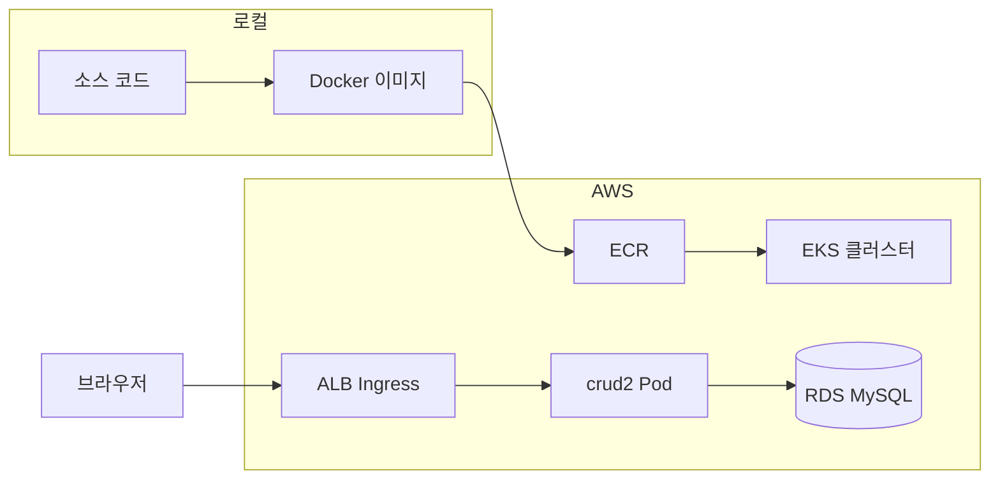

# crud2 — Docker부터 EKS 배포까지

`crud2` Spring Boot 앱을 **Docker 이미지**로 만든 뒤 **Amazon EKS**에 올려 **RDS MySQL**에 연결하는 전체 흐름을 정리한 문서입니다.

> 더 상세한 매니페스트·CI/CD 내용은 [`git-to-eks-deployment.md`](./git-to-eks-deployment.md)를 참고하세요.

---

## 전체 그림



| 단계 | 역할 |
|------|------|
| Docker | Spring Boot JAR를 컨테이너로 패키징 |
| ECR | 이미지 저장소 (EKS가 pull) |
| EKS | Pod 스케줄링, 무중단 배포, 확장 |
| RDS | 운영 MySQL |
| ALB Ingress | 외부 HTTP/HTTPS 진입점 |

---

## 1단계: Docker 이미지 만들기

`crud2`는 루트의 `Dockerfile`로 **멀티 스테이지 빌드**합니다.

1. **빌드 스테이지**: Gradle로 `bootJar` 실행 → fat JAR 생성
2. **실행 스테이지**: JRE만 포함, `app.jar` 실행, 포트 **8080**

```powershell
cd e:\crud2
docker build -t crud2:latest .
```

로컬에서 `./gradlew bootJar`를 먼저 돌릴 필요는 **없다**. Dockerfile이 컨테이너 안에서 빌드한다.

### 로컬 테스트

**Docker Compose** (MySQL + 앱, `docker` 프로파일):

```powershell
docker compose up --build
```

- 브라우저: `http://localhost:8080/list`

**RDS 연결 테스트** (`prod` 프로파일):

```powershell
docker run -d -p 8080:8080 --name crud2-app `
  -e SPRING_PROFILES_ACTIVE=prod `
  -e SPRING_DATASOURCE_URL="jdbc:mysql://<RDS엔드포인트>:3306/crud2_db?characterEncoding=UTF-8&serverTimezone=Asia/Seoul&allowPublicKeyRetrieval=true" `
  -e SPRING_DATASOURCE_USERNAME=crud2 `
  -e SPRING_DATASOURCE_PASSWORD=<비밀번호> `
  crud2:latest
```

### 프로파일 정리

| 프로파일 | DB | 용도 |
|----------|-----|------|
| (기본) | H2 | IDE / `gradlew bootRun` |
| `docker` | MySQL (Compose) | 로컬 컨테이너 테스트 |
| `prod` | RDS MySQL | **EKS 운영** |

EKS에서는 반드시 **`SPRING_PROFILES_ACTIVE=prod`** 를 사용한다.

---

## 2단계: AWS 인프라 준비

EKS 배포 전에 아래 리소스가 필요하다.

### 2-1. RDS MySQL

| 항목 | 권장 |
|------|------|
| 엔진 | MySQL 8.x |
| DB 이름 | `crud2_db` |
| 퍼블릭 액세스 | **비활성화** |
| VPC | EKS와 **같은 VPC** |
| 보안 그룹 | EKS 노드 SG에서 **3306** 허용 |

### 2-2. ECR (이미지 저장소)

```powershell
aws ecr create-repository --repository-name crud2 --region ap-northeast-2

# ECR 로그인
aws ecr get-login-password --region ap-northeast-2 | docker login --username AWS --password-stdin <계정ID>.dkr.ecr.ap-northeast-2.amazonaws.com

# 빌드 → 태그 → push
docker build -t crud2:latest .
docker tag crud2:latest <계정ID>.dkr.ecr.ap-northeast-2.amazonaws.com/crud2:latest
docker push <계정ID>.dkr.ecr.ap-northeast-2.amazonaws.com/crud2:latest
```

---

## 3단계: EKS 클러스터 생성

### 필요 도구

| 도구 | 용도 |
|------|------|
| AWS CLI | `aws configure` |
| kubectl | 클러스터 제어 |
| eksctl | EKS 생성 (권장) |
| Helm | ALB Controller 설치 |

### 클러스터 생성 예시 (`cluster.yaml`)

```yaml
apiVersion: eksctl.io/v1alpha5
kind: ClusterConfig
metadata:
  name: crud2-cluster
  region: ap-northeast-2
nodeGroups:
  - name: ng-1
    instanceType: t3.medium
    desiredCapacity: 2
    minSize: 1
    maxSize: 3
```

```powershell
eksctl create cluster -f cluster.yaml
aws eks update-kubeconfig --region ap-northeast-2 --name crud2-cluster
kubectl get nodes
```

### ALB Ingress Controller

외부에서 접속하려면 **AWS Load Balancer Controller** 설치가 필요하다.

```powershell
eksctl utils associate-iam-oidc-provider --cluster crud2-cluster --approve

helm repo add eks https://aws.github.io/eks-charts
helm install aws-load-balancer-controller eks/aws-load-balancer-controller `
  -n kube-system `
  --set clusterName=crud2-cluster `
  --set serviceAccount.create=false `
  --set serviceAccount.name=aws-load-balancer-controller
```

상세 IAM 설정은 [AWS 공식 문서](https://docs.aws.amazon.com/ko_kr/eks/latest/userguide/aws-load-balancer-controller.html)를 참고한다.

---

## 4단계: Kubernetes 매니페스트 (`k8s/`)

프로젝트에 `k8s/` 폴더를 만들고 아래 5개 파일을 적용한다.

### 4-1. Secret — DB 비밀번호

`k8s/secret.yaml`:

```yaml
apiVersion: v1
kind: Secret
metadata:
  name: crud2-db-secret
type: Opaque
stringData:
  username: crud2
  password: "<RDS비밀번호>"
```

> 운영 환경에서는 **AWS Secrets Manager + External Secrets Operator** 사용을 권장한다.

### 4-2. ConfigMap — 비밀 아닌 설정

`k8s/configmap.yaml`:

```yaml
apiVersion: v1
kind: ConfigMap
metadata:
  name: crud2-config
data:
  SPRING_PROFILES_ACTIVE: "prod"
  SPRING_DATASOURCE_URL: "jdbc:mysql://<RDS엔드포인트>:3306/crud2_db?characterEncoding=UTF-8&serverTimezone=Asia/Seoul&allowPublicKeyRetrieval=true"
```

### 4-3. Deployment — 앱 Pod

`k8s/deployment.yaml`:

```yaml
apiVersion: apps/v1
kind: Deployment
metadata:
  name: crud2
  labels:
    app: crud2
spec:
  replicas: 2
  selector:
    matchLabels:
      app: crud2
  template:
    metadata:
      labels:
        app: crud2
    spec:
      containers:
        - name: crud2
          image: <계정ID>.dkr.ecr.ap-northeast-2.amazonaws.com/crud2:latest
          ports:
            - containerPort: 8080
          envFrom:
            - configMapRef:
                name: crud2-config
          env:
            - name: SPRING_DATASOURCE_USERNAME
              valueFrom:
                secretKeyRef:
                  name: crud2-db-secret
                  key: username
            - name: SPRING_DATASOURCE_PASSWORD
              valueFrom:
                secretKeyRef:
                  name: crud2-db-secret
                  key: password
          readinessProbe:
            httpGet:
              path: /list
              port: 8080
            initialDelaySeconds: 30
            periodSeconds: 10
          livenessProbe:
            httpGet:
              path: /list
              port: 8080
            initialDelaySeconds: 60
            periodSeconds: 30
          resources:
            requests:
              memory: "512Mi"
              cpu: "250m"
            limits:
              memory: "1Gi"
              cpu: "500m"
```

### 4-4. Service — ClusterIP

`k8s/service.yaml`:

```yaml
apiVersion: v1
kind: Service
metadata:
  name: crud2
spec:
  selector:
    app: crud2
  ports:
    - port: 80
      targetPort: 8080
  type: ClusterIP
```

### 4-5. Ingress — ALB

`k8s/ingress.yaml`:

```yaml
apiVersion: networking.k8s.io/v1
kind: Ingress
metadata:
  name: crud2-ingress
  annotations:
    kubernetes.io/ingress.class: alb
    alb.ingress.kubernetes.io/scheme: internet-facing
    alb.ingress.kubernetes.io/target-type: ip
    alb.ingress.kubernetes.io/listen-ports: '[{"HTTP": 80}]'
spec:
  rules:
    - http:
        paths:
          - path: /
            pathType: Prefix
            backend:
              service:
                name: crud2
                port:
                  number: 80
```

HTTPS 적용 시 ACM 인증서 ARN 어노테이션 추가:

```yaml
alb.ingress.kubernetes.io/certificate-arn: arn:aws:acm:ap-northeast-2:<계정ID>:certificate/<인증서ID>
alb.ingress.kubernetes.io/listen-ports: '[{"HTTP": 80}, {"HTTPS": 443}]'
alb.ingress.kubernetes.io/ssl-redirect: '443'
```

---

## 5단계: 배포 실행

```powershell
kubectl apply -f k8s/secret.yaml
kubectl apply -f k8s/configmap.yaml
kubectl apply -f k8s/deployment.yaml
kubectl apply -f k8s/service.yaml
kubectl apply -f k8s/ingress.yaml
```

### 확인

```powershell
kubectl get pods
kubectl logs -l app=crud2
kubectl get ingress
```

Ingress **ADDRESS** (ALB DNS)로 접속:

```
http://<ALB-DNS>/list
```

> 루트 `/` 는 매핑이 없다. 반드시 **`/list`** 로 접속한다.

---

## 6단계: 네트워크·보안 체크리스트

| 항목 | 확인 |
|------|------|
| RDS SG | EKS 노드 SG에서 3306 허용 |
| RDS VPC | EKS와 동일 |
| ECR 권한 | 노드 IAM Role에 `AmazonEC2ContainerRegistryReadOnly` |
| 비밀번호 | Git·평문 YAML 저장 금지 → Secret / Secrets Manager |
| HTTPS | ACM 인증서 + Ingress `certificate-arn` 어노테이션 |

### 자주 나는 오류

| 증상 | 원인 | 해결 |
|------|------|------|
| `Communications link failure` | RDS SG 차단 | RDS SG에 EKS 노드 SG 추가 |
| `Connect timed out` | VPC 불일치 | 같은 VPC로 이동 |
| `Access denied` | 계정 오류 | Secret 값 확인 |
| `CrashLoopBackOff` | JDBC URL 오류 | ConfigMap URL 확인 |

---

## 한 줄 요약 (순서)

1. `docker build` → 로컬 테스트 (`docker compose up` 또는 `docker run`)
2. **ECR**에 이미지 push
3. **RDS MySQL** 생성 (EKS와 같은 VPC)
4. **eksctl**로 EKS 클러스터 생성 + ALB Controller 설치
5. `k8s/` 매니페스트 작성 → `kubectl apply`
6. ALB DNS로 `http://<ALB-DNS>/list` 확인
7. (선택) GitHub Actions로 push 시 자동 빌드·배포

---

## EC2 vs EKS

| 항목 | EC2 + Docker | EKS |
|------|-------------|-----|
| 난이도 | 낮음 | 높음 |
| 비용 | EC2 1대 | 클러스터 + 노드 + ALB |
| 확장 | 수동 | `replicas` 조정, HPA |
| 무중단 배포 | 어려움 | Rolling update 기본 |
| 적합 | 학습·소규모 | 트래픽 증가·운영 자동화 |

---

## 관련 문서

| 문서 | 내용 |
|------|------|
| [git-to-eks-deployment.md](./git-to-eks-deployment.md) | Git 설정부터 EKS·CI/CD까지 상세 가이드 |
| [crud2-docker-image.md](./crud2-docker-image.md) | Docker 이미지 빌드·실행 상세 |
| [deployment-full-journey.md](./deployment-full-journey.md) | EC2 + Docker + RDS 실전 기록 |
| [docker-deployment.md](./docker-deployment.md) | 로컬 Docker / Compose |
| [spring-boot-docker-aws-guide.md](./spring-boot-docker-aws-guide.md) | Spring Boot + Docker + AWS 가이드 |

---

이 문서는 `crud2` 프로젝트 기준으로 작성되었다.  
실제 엔드포인트·계정·IP·계정 ID는 배포 시 본인 AWS 콘솔 값으로 바꿔 사용한다.
