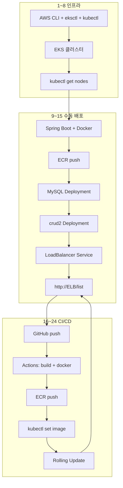

# crud2 — EKS 배포 + GitHub Actions CI/CD (24단계)

RDS 없이 **EKS 클러스터 안에 MySQL Pod**를 올리고, Spring Boot 앱을 배포한 뒤 **GitHub Actions**로 push 시 자동 빌드·ECR push·EKS Rolling Update까지 하는 전체 흐름입니다.

> 기반 문서: [`eks-simple-no-rds.md`](./eks-simple-no-rds.md)  
> 학습·데모용입니다. MySQL 데이터는 Pod 내 **`emptyDir`** 에 저장됩니다.

---

## 전체 순서

```
 1. AWS 계정 준비
        │
        ▼
 2. AWS CLI 설치
        │
        ▼
 3. aws configure
        │
        ▼
 4. eksctl 설치
        │
        ▼
 5. kubectl 설치
        │
        ▼
 6. EKS 클러스터 생성
        │
        ▼
 7. kubectl 연결
        │
        ▼
 8. kubectl get nodes
        │
        ▼
 9. Spring Boot 프로젝트 작성
        │
        ▼
10. Docker 이미지 생성
        │
        ▼
11. Amazon ECR에 Docker 이미지 업로드
        │
        ▼
12. MySQL Deployment 생성
        │
        ▼
13. Spring Boot Deployment 생성
        │
        ▼
14. Service (LoadBalancer) 생성
        │
        ▼
15. ELB 주소로 접속 확인
        │
        ▼
────────────────────────────────────
        GitHub CI/CD 구축
────────────────────────────────────
        │
        ▼
16. GitHub Repository 생성
        │
        ▼
17. GitHub Actions Workflow 작성
        │
        ▼
18. GitHub Secrets 등록
    (AWS_ACCESS_KEY_ID,
     AWS_SECRET_ACCESS_KEY,
     AWS_REGION 등)
        │
        ▼
19. Git Push
        │
        ▼
20. GitHub Actions 실행
        ├── Spring Boot 빌드
        ├── Docker 이미지 생성
        ├── Amazon ECR 로그인
        ├── Docker 이미지 Push
        └── kubectl apply 또는 kubectl set image
        │
        ▼
21. EKS Deployment 자동 업데이트
        │
        ▼
22. 새로운 Pod 생성 (Rolling Update)
        │
        ▼
23. Service는 그대로 유지
        │
        ▼
24. ELB 주소에서 최신 버전 확인
```



| 구성 | 이 가이드에서 사용 |
|------|-------------------|
| DB | **MySQL 8.4 Pod** (`mysql` Service, `emptyDir`) |
| 앱 DB 연결 | `jdbc:mysql://mysql:3306/crud2_db` (`k8s` 프로파일) |
| 이미지 저장소 | **Amazon ECR** |
| 외부 접속 | `LoadBalancer` Service (앱만) |
| CI/CD | **GitHub Actions** |
| RDS | **사용 안 함** |

---

# Part 1 — 인프라 및 수동 배포 (1~15단계)

## 1. AWS 계정 준비

- [AWS 콘솔](https://console.aws.amazon.com/)에서 계정을 만든다.
- **IAM 사용자**를 만들고 프로그래밍 방식 액세스용 **Access Key**를 발급한다.
- EKS·EC2·ELB·ECR·CloudFormation 생성 권한이 필요하다. (학습용: `AdministratorAccess` — 운영에서는 최소 권한 권장)
- **비용 주의**: EKS 클러스터·EC2 노드·LoadBalancer에 시간당 요금이 발생한다. 실습 후 클러스터를 삭제한다.

---

## 2. AWS CLI 설치

Windows (PowerShell):

```powershell
msiexec.exe /i https://awscli.amazonaws.com/AWSCLIV2.msi
```

설치 후 **IntelliJ·터미널을 재시작**하고 확인:

```powershell
aws --version
```

`aws`를 찾을 수 없으면 환경 변수 **Path**에 아래를 추가한다.

```
C:\Program Files\Amazon\AWSCLIV2\
```

macOS:

```bash
brew install awscli
```

---

## 3. aws configure

```powershell
aws configure
```

| 항목 | 입력 |
|------|------|
| AWS Access Key ID | IAM에서 발급한 키 |
| AWS Secret Access Key | IAM 시크릿 |
| Default region name | `ap-northeast-2` (서울) |
| Default output format | `json` |

연결 확인:

```powershell
aws sts get-caller-identity
```

---

## 4. eksctl 설치

### 방법 A — zip 수동 설치 (권장)

1. [eksctl 릴리스](https://github.com/eksctl-io/eksctl/releases)에서 **`eksctl_Windows_amd64.zip`** 다운로드
2. 압축 해제 → `eksctl.exe`를 `C:\tools\eksctl\` 등에 복사
3. 해당 폴더를 **Path**에 추가
4. IntelliJ 재시작 후 확인:

```powershell
eksctl version
```

> `eksctl.exe`는 **더블클릭용이 아닙니다.** 터미널에서만 사용합니다.

### 방법 B — Chocolatey

관리자 PowerShell:

```powershell
choco install eksctl -y
```

---

## 5. kubectl 설치

```powershell
choco install kubernetes-cli -y
# 또는
winget install Kubernetes.kubectl
```

확인:

```powershell
kubectl version --client
```

---

## 6. EKS 클러스터 생성

프로젝트의 `k8s/cluster.yaml`을 사용한다.

```powershell
cd d:\crud2
eksctl create cluster -f k8s/cluster.yaml --timeout 45m
```

| 항목 | 값 |
|------|-----|
| 클러스터 이름 | `crud2-cluster` |
| 리전 | `ap-northeast-2` |
| 노드 | `t3.medium` × 2 |

**15~30분** 걸릴 수 있다. `waiting for CloudFormation stack...` 반복은 정상이다.

### 타임아웃·노드 실패가 반복될 때

`k8s/cluster.yaml`에서 인스턴스 타입을 낮춘다.

```yaml
instanceType: t3.small
```

노드만 없고 클러스터는 있는 경우:

```powershell
eksctl create nodegroup -f k8s/cluster.yaml --timeout 45m
```

---

## 7. kubectl 연결

**한 줄씩** 실행한다.

```powershell
aws eks update-kubeconfig --region ap-northeast-2 --name crud2-cluster
```

```powershell
kubectl config current-context
```

`arn:aws:eks:ap-northeast-2:...:cluster/crud2-cluster` 형태가 보이면 연결된 것이다.

---

## 8. kubectl get nodes

```powershell
kubectl get nodes
```

예시:

```
NAME                                            STATUS   ROLES    AGE   VERSION
ip-172-31-xx-xx.ap-northeast-2.compute.internal Ready    <none>   10m   v1.34.x
ip-172-31-xx-xx.ap-northeast-2.compute.internal Ready    <none>   10m   v1.34.x
```

`STATUS`가 **Ready**이고 노드 **2개**가 보이면 다음 단계로 진행한다.

`No resources found`이면 CloudFormation에서 `eksctl-crud2-cluster-nodegroup-ng-1` 스택 상태를 확인한다. [트러블슈팅](#자주-겪는-이슈) 참고.

---

## 9. Spring Boot 프로젝트 작성

이 저장소(`crud2`)를 쓰는 경우 **이미 완성된 프로젝트**이므로 작성 단계는 확인만 하면 된다.

| 항목 | 내용 |
|------|------|
| 스택 | Spring Boot 3, Java 17, Thymeleaf, JPA |
| 로컬 실행 | `.\gradlew.bat bootRun` → `http://localhost:8080/list` |
| EKS용 프로파일 | `k8s` → `application-k8s.properties` |
| 주요 URL | `/list`, `/mains/add` 등 (루트 `/` 는 매핑 없음) |

새 프로젝트를 만드는 경우 [spring-initializr-setup.md](./spring-initializr-setup.md)를 참고한다.

로컬 확인 (선택):

```powershell
docker compose up --build
```

브라우저: `http://localhost:8080/list`

---

## 10. Docker 이미지 생성

`crud2` 루트의 `Dockerfile`로 멀티 스테이지 빌드한다.

```powershell
cd d:\crud2
docker build -t crud2:latest .
```

---

## 11. Amazon ECR에 Docker 이미지 업로드

> **Docker Desktop** Running 필수. `docker compose up`은 필수 아님.

```powershell
# 리포지토리 생성 (최초 1회)
aws ecr create-repository --repository-name crud2 --region ap-northeast-2

# 계정 ID · ECR 주소
$ACCOUNT_ID = aws sts get-caller-identity --query Account --output text
$ECR_REGISTRY = "$ACCOUNT_ID.dkr.ecr.ap-northeast-2.amazonaws.com"

docker version
```

### ECR 로그인 (Windows PowerShell — 권장)

`$ECR_REGISTRY`가 비어 있으면 Docker Hub로 로그인되어 **malformed Authorization header** 가 난다.

```powershell
echo "ECR_REGISTRY=$ECR_REGISTRY"

$token = (aws ecr get-login-password --region ap-northeast-2).Trim()
if ($token.Length -lt 100) { throw "ECR 토큰 없음 — aws configure / IAM 확인" }
docker login --username AWS --password $token $ECR_REGISTRY
```

### 태그 & push

```powershell
docker tag crud2:latest ${ECR_REGISTRY}/crud2:latest
docker push ${ECR_REGISTRY}/crud2:latest
```

이미지 주소 예:

```
123456789012.dkr.ecr.ap-northeast-2.amazonaws.com/crud2:latest
```

### Deployment 이미지 주소 수정

`k8s/deployment.yaml`의 `image:` 값을 push한 주소로 바꾼다.

```yaml
image: <계정ID>.dkr.ecr.ap-northeast-2.amazonaws.com/crud2:latest
```

---

## 12. MySQL Deployment 생성

**MySQL을 먼저** 올린다. **14단계 Service보다 반드시 앞서** 실행한다.

```powershell
kubectl apply -f k8s/mysql-secret.yaml
kubectl apply -f k8s/mysql.yaml
```

MySQL Pod Ready 대기:

```powershell
kubectl get pods -l app=mysql -w
```

`READY`가 **1/1**이 되면 `Ctrl+C`로 watch를 멈춘다. (또는 아래 `wait` 사용)

```powershell
kubectl wait --for=condition=ready pod -l app=mysql --timeout=300s
kubectl get pods -l app=mysql
```

> `-w`는 Pod 상태가 바뀔 때마다 **실시간으로** 보여 준다. `0/1` → `1/1`로 바뀌는지 확인할 때 유용하다.

| 항목 | 값 |
|------|-----|
| MySQL 이미지 | `mysql:8.4` |
| Service 이름 | `mysql` |
| DB 이름 | `crud2_db` |
| 사용자 / 비밀번호 | `crud2` / `crud2` |
| 데이터 저장 | Pod 내 `emptyDir` (학습용) |

---

## 13. Spring Boot Deployment 생성

**12단계 MySQL이 1/1 Running인 뒤** 실행한다.

```powershell
kubectl apply -f k8s/deployment.yaml
```

Pod 상태 실시간 확인 (`-w` = watch, `Ctrl+C`로 종료):

```powershell
kubectl get pods -l app=crud2 -w
```

| READY | 의미 |
|-------|------|
| `0/1 Running` | 기동 중 (보통 **1~3분**) — readinessProbe 40초 후 Ready |
| `1/1 Running` | 접속 가능 — **15단계**로 |

또는 자동 대기:

```powershell
kubectl wait --for=condition=ready pod -l app=crud2 --timeout=300s
kubectl get pods -l app=crud2
kubectl logs -l app=crud2
```

로그에 `Started Crud2Application`이 보이면 성공이다.  
앱은 `initContainer`로 MySQL 포트(`mysql:3306`)가 열릴 때까지 기다린다.

---

## 14. Service (LoadBalancer) 생성

**13단계에서 crud2 Pod가 1/1 Running인 뒤** (또는 동시에) 실행한다.  
Service만 먼저 만들면 ELB DNS는 나와도 **crud2 Pod가 없으면 링크가 안 된다.**

```powershell
kubectl apply -f k8s/service.yaml
kubectl get svc crud2
```

ELB DNS가 붙을 때까지 watch (선택):

```powershell
kubectl get svc crud2 -w
```

처음에는 `EXTERNAL-IP`가 `<pending>`이다. 1~3분 후 AWS Load Balancer DNS가 붙는다.

```
NAME    TYPE           EXTERNAL-IP
crud2   LoadBalancer   k8s-crud2-xxxxx.ap-northeast-2.elb.amazonaws.com
```

---

## 15. ELB 주소로 접속 확인

### 접속 전 체크 (필수)

```powershell
kubectl get pods
kubectl get pods -l app=crud2
kubectl get endpoints crud2
```

| 확인 | 정상 |
|------|------|
| mysql | `1/1 Running` |
| crud2 | `1/1 Running` |
| endpoints `crud2` | `192.168.x.x:8080` 등 IP 표시 (`<none>`이면 아직 접속 불가) |

### 브라우저 접속

```
http://<EXTERNAL-IP 또는 ELB DNS>/list
```

- **`http://`** (`https` 아님)
- 끝에 **`/list`** (루트 `/` 는 매핑 없음)

ELB DNS는 나왔는데 **“전송한 데이터가 없습니다”** 가 나오면 → crud2가 `0/1`이거나 endpoints가 비어 있는 것. **13단계**부터 다시 확인.

추가 확인:

```powershell
kubectl get svc
kubectl logs -l app=crud2 --tail=50
```

**15단계까지 완료하면 수동 배포는 끝**이다. 이후 CI/CD로 push만으로 배포를 자동화한다.

---

# Part 2 — GitHub CI/CD (16~24단계)

## 16. GitHub Repository 생성

1. [GitHub](https://github.com)에서 **New repository** → 이름 `crud2`
2. 로컬에서 원격 연결:

```powershell
cd d:\crud2
git init
git add .
git commit -m "Initial commit: crud2 EKS deploy"
git remote add origin https://github.com/<사용자명>/crud2.git
git branch -M main
```

> `.pem` 키, `.env`, RDS 비밀번호는 **절대 커밋하지 않는다.** `.gitignore`에 `*.tar`, `*.pem` 등이 포함되어 있는지 확인한다.

---

## 17. GitHub Actions Workflow 작성

프로젝트에 `.github/workflows/deploy-eks.yml` 파일을 만든다.

```yaml
name: Deploy to EKS

on:
  push:
    branches: [main]

env:
  AWS_REGION: ap-northeast-2
  ECR_REPOSITORY: crud2
  EKS_CLUSTER_NAME: crud2-cluster
  DEPLOYMENT_NAME: crud2
  CONTAINER_NAME: crud2

jobs:
  deploy:
    runs-on: ubuntu-latest

    steps:
      - name: Checkout
        uses: actions/checkout@v4

      - name: Configure AWS credentials
        uses: aws-actions/configure-aws-credentials@v4
        with:
          aws-access-key-id: ${{ secrets.AWS_ACCESS_KEY_ID }}
          aws-secret-access-key: ${{ secrets.AWS_SECRET_ACCESS_KEY }}
          aws-region: ${{ secrets.AWS_REGION }}

      - name: Login to Amazon ECR
        id: login-ecr
        uses: aws-actions/amazon-ecr-login@v2

      - name: Build, tag, and push image to Amazon ECR
        env:
          ECR_REGISTRY: ${{ steps.login-ecr.outputs.registry }}
          IMAGE_TAG: ${{ github.sha }}
        run: |
          docker build -t $ECR_REGISTRY/$ECR_REPOSITORY:$IMAGE_TAG .
          docker push $ECR_REGISTRY/$ECR_REPOSITORY:$IMAGE_TAG
          docker tag $ECR_REGISTRY/$ECR_REPOSITORY:$IMAGE_TAG $ECR_REGISTRY/$ECR_REPOSITORY:latest
          docker push $ECR_REGISTRY/$ECR_REPOSITORY:latest

      - name: Update kubeconfig
        run: aws eks update-kubeconfig --region $AWS_REGION --name $EKS_CLUSTER_NAME

      - name: Deploy to EKS (Rolling Update)
        env:
          ECR_REGISTRY: ${{ steps.login-ecr.outputs.registry }}
          IMAGE_TAG: ${{ github.sha }}
        run: |
          kubectl set image deployment/$DEPLOYMENT_NAME \
            $CONTAINER_NAME=$ECR_REGISTRY/$ECR_REPOSITORY:$IMAGE_TAG
          kubectl rollout status deployment/$DEPLOYMENT_NAME --timeout=300s
```

### Workflow가 하는 일

| 단계 | 내용 |
|------|------|
| 트리거 | `main` 브랜치에 `git push` |
| 빌드 | Docker 멀티 스테이지 (`Dockerfile` 내 Gradle `bootJar`) |
| ECR | 로그인 → 이미지 push (`latest` + 커밋 SHA 태그) |
| 배포 | `kubectl set image` → Deployment Rolling Update |

> MySQL·Service는 **최초 1회 수동 apply**(12~14단계) 후, CI/CD는 **crud2 앱 이미지만** 갱신한다.

---

## 18. GitHub Secrets 등록

GitHub 저장소 → **Settings** → **Secrets and variables** → **Actions** → **New repository secret**

| Secret 이름 | 값 |
|-------------|-----|
| `AWS_ACCESS_KEY_ID` | IAM 액세스 키 |
| `AWS_SECRET_ACCESS_KEY` | IAM 시크릿 키 |
| `AWS_REGION` | `ap-northeast-2` |

### IAM 권한 (CI/CD용 사용자)

최소한 아래 권한이 필요하다. 학습용으로는 EKS·ECR·EC2를 다루는 정책을 붙인다.

| 서비스 | 필요 권한 |
|--------|-----------|
| ECR | `ecr:GetAuthorizationToken`, `ecr:BatchCheckLayerAvailability`, `ecr:PutImage`, `ecr:InitiateLayerUpload`, `ecr:UploadLayerPart`, `ecr:CompleteLayerUpload` |
| EKS | `eks:DescribeCluster` (kubeconfig용) |
| kubectl | 클러스터를 **만든 IAM 사용자와 동일**하거나, EKS `aws-auth` / Access Entry에 CI/CD용 IAM이 등록되어 있어야 한다 |

---

## 19. Git Push

Workflow 파일을 커밋하고 push한다.

```powershell
git add .github/workflows/deploy-eks.yml
git commit -m "Add GitHub Actions EKS deploy workflow"
git push -u origin main
```

---

## 20. GitHub Actions 실행

GitHub 저장소 → **Actions** 탭에서 `Deploy to EKS` 워크플로 실행을 확인한다.

자동으로 수행되는 작업:

1. Spring Boot 소스 checkout
2. `docker build` (Gradle `bootJar` 포함)
3. Amazon ECR 로그인
4. Docker 이미지 push
5. `kubectl set image` 로 Deployment 이미지 변경

실패 시 Actions 로그에서 빨간 단계를 확인한다.

---

## 21. EKS Deployment 자동 업데이트

`kubectl set image`가 실행되면 Kubernetes가 Deployment의 Pod 템플릿 이미지를 새 태그로 바꾼다.  
Deployment·Service 리소스 자체는 그대로이고, **컨테이너 이미지만** 바뀐다.

확인:

```powershell
kubectl get deployment crud2
kubectl describe deployment crud2
```

---

## 22. 새로운 Pod 생성 (Rolling Update)

Kubernetes는 기본 **RollingUpdate** 전략으로 새 Pod를 띄운 뒤, readiness 통과 후 구 Pod를 종료한다.

```powershell
kubectl rollout status deployment/crud2
kubectl get pods -l app=crud2 -w
```

`READY 1/1`인 새 Pod가 뜨고 구 Pod가 `Terminating` 되면 정상이다.

---

## 23. Service는 그대로 유지

`kubectl set image`는 **Deployment만** 변경한다.

- **LoadBalancer Service** (`k8s/service.yaml`)는 수정하지 않는다.
- **ELB DNS 주소는 변하지 않는다.**
- MySQL Deployment도 CI/CD 대상이 아니면 그대로 유지한다.

```powershell
kubectl get svc crud2
```

`EXTERNAL-IP`가 이전과 동일한지 확인한다.

---

## 24. ELB 주소에서 최신 버전 확인

브라우저에서 **같은 URL**로 접속한다.

```
http://<ELB DNS>/list
```

코드에 눈에 띄는 변경(예: 목록 페이지 문구)을 넣었다면 반영 여부를 확인한다.

추가 확인:

```powershell
kubectl get pods -l app=crud2
kubectl logs -l app=crud2 --tail=30
```

GitHub Actions의 **IMAGE_TAG**(`github.sha`)와 Pod가 사용 중인 이미지가 일치하는지:

```powershell
kubectl get pod -l app=crud2 -o jsonpath="{.items[0].spec.containers[0].image}"
```

---

# 정리 및 비용 절감

```powershell
kubectl delete -f k8s/service.yaml
kubectl delete -f k8s/deployment.yaml
kubectl delete -f k8s/mysql.yaml
kubectl delete -f k8s/mysql-secret.yaml
eksctl delete cluster --name crud2-cluster --region ap-northeast-2
```

ECR 이미지 삭제 (선택):

```powershell
aws ecr delete-repository --repository-name crud2 --force --region ap-northeast-2
```

---

## 자주 겪는 이슈

### EKS 클러스터 생성

| 증상 | 원인 | 조치 |
|------|------|------|
| `exceeded max wait time` | 노드 그룹 생성 지연 | `kubectl get nodes` 먼저 확인. 없으면 `--timeout 45m` 또는 `t3.small` |
| `AlreadyExistsException` | CloudFormation 스택 잔존 | `eksctl delete cluster` 또는 콘솔에서 스택 수동 삭제 후 재생성 |
| `No cluster found` (delete 시) | EKS는 없고 스택만 남음 | CloudFormation에서 `eksctl-crud2-cluster-*` 스택 삭제 |
| `will be excluded` / `no tasks` | nodegroup 스택 찌꺼기 | `nodegroup-ng-1` 스택 삭제 → `eksctl create nodegroup` |
| `No resources found` (nodes) | 노드 그룹 미완료 | CloudFormation nodegroup 스택·이벤트 확인 |

### 앱 배포

| 증상 | 원인 | 조치 |
|------|------|------|
| `ImagePullBackOff` | ECR 주소·push 오류 | 11단계·`deployment.yaml`의 `image:` 확인 |
| MySQL `Pending` / wait 타임아웃 | PVC·EBS CSI 미설정 | `k8s/mysql.yaml`은 `emptyDir` 사용 ([eks-simple-no-rds.md](./eks-simple-no-rds.md) 10단계) |
| `EXTERNAL-IP` pending | LB 생성 지연 | 3~5분 대기 |
| 502 / 연결 안 됨 / 전송한 데이터 없음 | Pod Ready 전·endpoints 비어 있음 | crud2 **1/1**·`kubectl get endpoints crud2` 확인 후 `/list` |

### GitHub Actions

| 증상 | 원인 | 조치 |
|------|------|------|
| ECR push 실패 | IAM ECR 권한 부족 | Secrets·IAM 정책 확인 |
| ECR `docker login` 400 (로컬) | PowerShell 파이프·인코딩 | [eks-simple-no-rds.md](./eks-simple-no-rds.md) 9단계 Windows 로그인 방식 |
| `kubectl` 권한 오류 | CI/CD IAM이 클러스터 미등록 | 클러스터 생성에 쓴 IAM과 동일 키 사용 또는 `aws-auth` 설정 |
| Rolling Update 실패 | 이미지 pull·앱 기동 실패 | Actions 로그·`kubectl describe pod` |

---

## 관련 파일

| 파일 | 역할 |
|------|------|
| `Dockerfile` | Docker 이미지 빌드 |
| `src/main/resources/application-k8s.properties` | EKS용 MySQL 연결 |
| `k8s/cluster.yaml` | eksctl 클러스터 정의 |
| `k8s/mysql-secret.yaml` | DB 계정 Secret |
| `k8s/mysql.yaml` | MySQL Deployment + Service |
| `k8s/deployment.yaml` | crud2 앱 Deployment |
| `k8s/service.yaml` | LoadBalancer Service |
| `.github/workflows/deploy-eks.yml` | GitHub Actions (17단계에서 생성) |
| [eks-simple-no-rds.md](./eks-simple-no-rds.md) | 수동 배포 상세·PVC 트러블슈팅 |
| [git-to-eks-deployment.md](./git-to-eks-deployment.md) | Git + EKS (RDS·ALB Ingress 버전) |

---

이 문서는 `crud2` 프로젝트 기준으로 작성되었다.  
`<계정ID>`, 이미지 주소, ELB DNS는 본인 AWS 환경 값으로 바꿔 사용한다.
