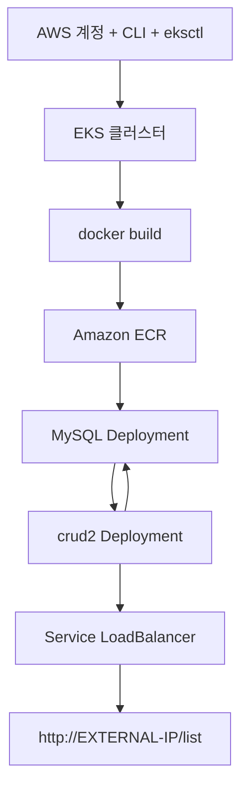

# crud2 — RDS 없이 EKS 배포 (12단계, MySQL 포함)

RDS 대신 **EKS 클러스터 안에 MySQL Pod**를 함께 올리고, `crud2` 앱이 `mysql:3306`으로 접속하는 **최소 흐름**입니다.  
`docker-compose.yml`과 같은 구성(MySQL + Spring Boot)을 쿠버네티스로 옮긴 형태입니다.

외부 노출은 **Ingress(ALB) 없이** `Service type: LoadBalancer`만 사용합니다.

> 학습·데모용입니다. MySQL 데이터는 Pod 내 **`emptyDir`** 에 저장됩니다 (Pod 재생성 시 데이터 소실 가능). 대규모 운영에는 RDS 또는 PVC를 권장합니다.

---

## 전체 순서

```
1. AWS 계정 준비
        ↓
2. AWS CLI 설치
        ↓
3. aws configure
        ↓
4. eksctl 설치
        ↓
5. EKS 클러스터 생성
        ↓
6. kubectl 연결 확인
        ↓
7. kubectl get nodes
        ↓
8. Spring Boot Docker 이미지 생성
        ↓
9. Amazon ECR 업로드
        ↓
10. Deployment 생성
        ↓
11. Service (LoadBalancer) 생성
        ↓
12. 접속 확인
```



| 구성 | 이 가이드에서 사용 |
|------|-------------------|
| DB | **MySQL 8.4 Pod** (`mysql` Service, `emptyDir`) |
| 앱 DB 연결 | `jdbc:mysql://mysql:3306/crud2_db` (`k8s` 프로파일) |
| 이미지 저장소 | **Amazon ECR** |
| 외부 접속 | `LoadBalancer` Service (앱만) |
| RDS | **사용 안 함** |

---

## 1. AWS 계정 준비

- [AWS 콘솔](https://console.aws.amazon.com/)에서 계정을 만든다.
- **IAM 사용자**를 만들고 프로그래밍 방식 액세스용 **Access Key**를 발급한다.
- EKS·EC2·ELB 생성 권한이 있는 정책이 필요하다. (학습용: `AdministratorAccess` — 운영에서는 최소 권한 권장)
- **비용 주의**: EKS 클러스터 자체에 시간당 요금이 있고, EC2 노드·LoadBalancer 비용도 발생한다. 실습 후 `eksctl delete cluster`로 정리한다.

---

## 2. AWS CLI 설치

Windows (PowerShell):

```powershell
msiexec.exe /i https://awscli.amazonaws.com/AWSCLIV2.msi
aws --version
```

macOS:

```bash
brew install awscli
```

---

## 3. aws configure

```powershell
aws configure
```

| 항목 | 입력 |
|------|------|
| AWS Access Key ID | IAM에서 발급한 키 |
| AWS Secret Access Key | IAM 시크릿 |
| Default region name | `ap-northeast-2` (서울) |
| Default output format | `json` |

연결 확인:

```powershell
aws sts get-caller-identity
```

---

## 4. eksctl 설치

choco 설치
Set-ExecutionPolicy Bypass -Scope Process -Force; [System.Net.ServicePointManager]::SecurityProtocol = [System.Net.ServicePointManager]::SecurityProtocol -bor 3072; iex ((New-Object System.Net.WebClient).DownloadString('https://community.chocolatey.org/install.ps1'))

Windows (Chocolatey):

```powershell
choco install eksctl
```

또는 [eksctl 릴리스](https://github.com/eksctl-io/eksctl/releases)에서 바이너리를 받는다.

```powershell
eksctl version
```

**kubectl**도 함께 필요하다:

```powershell
choco install kubernetes-cli
# 또는
winget install Kubernetes.kubectl
```

---

## 5. EKS 클러스터 생성

프로젝트에 포함된 `k8s/cluster.yaml`을 사용한다.

```powershell
cd e:\crud2
eksctl create cluster -f k8s/cluster.yaml
```

- 클러스터 이름: `crud2-cluster`
- 리전: `ap-northeast-2`
- 노드: `t3.medium` × 2 (약 15~20분 소요)

---

## 6. kubectl 연결 확인

```powershell
aws eks update-kubeconfig --region ap-northeast-2 --name crud2-cluster
kubectl config current-context
```

`arn:aws:eks:ap-northeast-2:...:cluster/crud2-cluster` 형태가 보이면 연결된 것이다.

---

## 7. kubectl get nodes

```powershell
kubectl get nodes
```

예시:

```
NAME                                            STATUS   ROLES    AGE   VERSION
ip-172-31-xx-xx.ap-northeast-2.compute.internal Ready    <none>   10m   v1.29.x
ip-172-31-xx-xx.ap-northeast-2.compute.internal Ready    <none>   10m   v1.29.x
```

`STATUS`가 **Ready**이면 다음 단계로 진행한다.

---

## 8. Spring Boot Docker 이미지 생성

`crud2` 루트의 `Dockerfile`로 멀티 스테이지 빌드한다. (Gradle `bootJar` → JRE 이미지)

도커데스크탑 실행

```powershell
cd e:\crud2
docker build -t crud2:latest .
```

로컬 확인 (선택):

### 방법 1) docker compose (권장)

MySQL + 앱을 함께 띄운다. `k8s` 프로파일이 아니라 `docker` 프로파일을 쓴다.

```powershell
docker compose up --build
```

브라우저: `http://localhost:8080/list`

> `docker run` 단독 + `k8s` 프로파일은 호스트 `mysql`이 없어 `UnknownHostException`이 난다.  
> `k8s` 프로파일 로컬 테스트는 EKS처럼 MySQL을 먼저 띄우거나, compose를 쓰면 된다.

### 방법 2) EKS와 동일 설정 (`k8s` 프로파일, MySQL 별도 실행)

EKS 배포 전 연결만 확인할 때. MySQL 컨테이너 이름을 `mysql`로 맞춘다.

```powershell
docker network create crud2-net

docker run -d --name mysql --network crud2-net `
  -e MYSQL_ROOT_PASSWORD=root `
  -e MYSQL_DATABASE=crud2_db `
  -e MYSQL_USER=crud2 `
  -e MYSQL_PASSWORD=crud2 `
  mysql:8.4

docker run --rm -p 8080:8080 --network crud2-net `
  -e SPRING_PROFILES_ACTIVE=k8s `
  -e SPRING_DATASOURCE_USERNAME=crud2 `
  -e SPRING_DATASOURCE_PASSWORD=crud2 `
  crud2:latest
```

브라우저: `http://localhost:8080/list`

---

## 9. Amazon ECR 업로드

8단계에서 만든 Docker 이미지(`crud2:latest`)를 **AWS 클라우드 저장소(ECR)** 에 올리는 단계이다.

```
로컬 PC (docker build)  →  AWS ECR (저장)  →  EKS 노드 (pull해서 실행)
```

로컬에만 이미지가 있으면 EKS 워커 노드(EC2)는 그 이미지를 가져올 수 없다. **ECR에 push**해야 10단계에서 Pod가 이미지를 pull할 수 있다.

### 왜 ECR인가

| 항목 | 설명 |
|------|------|
| **ECR** | Amazon Elastic Container Registry — AWS용 Docker 이미지 저장소 |
| **EKS와 궁합** | 같은 AWS 계정·리전, 노드 IAM에 pull 권한이 기본으로 붙는 경우가 많음 |

> **사전 조건:** 8단계 `docker build -t crud2:latest .` 완료. **Docker Desktop** Running. `docker compose up`은 **필수 아님**.

### 9-1. 리포지토리 생성 (최초 1회)

ECR에 **`crud2`라는 이름의 이미지 보관함**을 만든다. 한 번 만들어 두면 이후 push만 하면 된다.

```powershell
aws ecr create-repository --repository-name crud2 --region ap-northeast-2
```

### 9-2. ECR 주소 준비

**본인 AWS 계정 ID**로 ECR 주소를 자동 설정한다. **같은 PowerShell 창**에서 이어서 써야 `$ECR_REGISTRY`가 유지된다.

```powershell
$ACCOUNT_ID = aws sts get-caller-identity --query Account --output text
$ECR_REGISTRY = "$ACCOUNT_ID.dkr.ecr.ap-northeast-2.amazonaws.com"
```

예: `561254776196.dkr.ecr.ap-northeast-2.amazonaws.com`

### 9-3. 환경 확인

```powershell
docker version
aws ecr describe-repositories --repository-names crud2 --region ap-northeast-2
```

### 9-4. ECR 로그인 (Windows PowerShell)

AWS가 **12시간짜리 임시 토큰**을 발급하고, Docker가 ECR에 push할 권한을 받는다.

`$ECR_REGISTRY`가 비어 있으면 Docker Hub(`registry-1.docker.io`)로 로그인을 시도해 **malformed Authorization header** 가 난다. **9-2를 먼저 실행**하고 주소를 확인한다.

```powershell
echo "ECR_REGISTRY=$ECR_REGISTRY"

$token = (aws ecr get-login-password --region ap-northeast-2).Trim()
if ($token.Length -lt 100) { throw "ECR 토큰 없음 — aws configure / IAM(ecr:GetAuthorizationToken) 확인" }
docker login --username AWS --password $token $ECR_REGISTRY
```

`Login Succeeded` 가 나오면 성공이다.

> Windows에서 `| docker login` 파이프·`cmd ... < file` 리다이렉트는 **400 Bad Request** 가 날 수 있어 `--password` 방식을 쓴다.

### 9-5. 태그 & push

| 명령 | 의미 |
|------|------|
| `docker tag` | 로컬 `crud2:latest`에 **ECR 주소 이름표**를 붙임 |
| `docker push` | ECR로 **업로드** |

```powershell
docker tag crud2:latest ${ECR_REGISTRY}/crud2:latest
docker push ${ECR_REGISTRY}/crud2:latest
```

push 성공 예:

```
latest: digest: sha256:ef364017... size: 856
```

- `digest` = 이미지 지문 (push 성공 확인용)
- 배포에는 아래 **`.../crud2:latest`** 주소를 쓴다 (`@sha256:...` digest는 선택)

이미지 주소 예:

```
123456789012.dkr.ecr.ap-northeast-2.amazonaws.com/crud2:latest
```

### 9-6. Deployment 이미지 주소 수정

10단계 `kubectl apply` **전에** `k8s/deployment.yaml`의 `image:` 값을 push한 주소로 바꾼다. EKS가 Pod를 만들 때 **이 주소에서 이미지를 pull**한다.

```yaml
image: <계정ID>.dkr.ecr.ap-northeast-2.amazonaws.com/crud2:latest
```

예시 (본인 계정 ID로 바꿀 것):

```
561254776196.dkr.ecr.ap-northeast-2.amazonaws.com/crud2:latest
```

### 9단계 흐름 요약

```
8단계  docker build     →  로컬에 이미지 생성
9단계  ECR push         →  AWS에 이미지 업로드
10단계 kubectl apply    →  EKS가 ECR에서 이미지 pull 후 Pod 실행
```

### 9단계에서 자주 하는 실수

| 실수 | 결과 |
|------|------|
| `docker build` 안 함 | push할 이미지 없음 |
| 새 터미널에서 tag/push | `$ECR_REGISTRY` 비어서 주소 오류 |
| login 없이 push | 인증 실패 |
| `deployment.yaml` 주소 안 바꿈 | `ImagePullBackOff` |

---

## 10. Deployment 생성 (MySQL → crud2 순서)

**MySQL을 먼저** 올린 뒤 앱을 배포한다.

```powershell
# 1) MySQL Secret + Deployment + Service
kubectl apply -f k8s/mysql-secret.yaml
kubectl apply -f k8s/mysql.yaml

# MySQL Pod Ready 대기 (최대 5분)
kubectl get pods -l app=mysql -w
```

`1/1 Running`이 되면 `Ctrl+C`. (또는 `kubectl wait` 사용)

```powershell
kubectl wait --for=condition=ready pod -l app=mysql --timeout=300s
kubectl get pods -l app=mysql
```

`READY`가 `1/1`인지 확인한다. `Pending`이면 아래 **자주 겪는 이슈** 참고.

```powershell
# 2) crud2 앱 (initContainer가 mysql:3306 준비될 때까지 대기)
kubectl apply -f k8s/deployment.yaml

# Pod 상태 실시간 확인 (-w = watch, Ctrl+C로 종료)
kubectl get pods -l app=crud2 -w
```

`0/1 Running`은 기동 중(1~3분). **`1/1 Running`**이 되면 다음으로.

```powershell
# 앱 Pod Ready 대기 (Spring Boot 기동에 30~90초 걸릴 수 있음)
kubectl wait --for=condition=ready pod -l app=crud2 --timeout=300s
kubectl get pods -l app=crud2
kubectl logs -l app=crud2
```

Pod가 `Running`이고 로그에 `Started Crud2Application`이 보이면 성공이다.

```powershell
kubectl describe pod -l app=crud2
```

| 증상 | 확인 |
|------|------|
| `ImagePullBackOff` | 9단계 이미지 주소·push 여부, `deployment.yaml`의 `image:` |
| MySQL `Pending` / `wait` 타임아웃 | `kubectl describe pod -l app=mysql` |
| crud2 `0/1 Running` | readinessProbe 대기 (30~90초), `kubectl logs -l app=crud2` |
| crud2가 MySQL 연결 실패 | MySQL Pod `Ready` 여부, `kubectl logs -l app=mysql` |

### MySQL `kubectl wait` 가 타임아웃될 때 (PVC → emptyDir)

처음 가이드는 MySQL 데이터를 **PVC(영구 디스크)** 로 붙이도록 되어 있었다.  
EKS 학습용 클러스터에서는 아래 이유로 PVC가 `Pending`에 걸려 **MySQL Pod가 뜨지 않고**, `kubectl wait`가 5분 뒤 타임아웃된다.

```
kubectl wait --for=condition=ready pod -l app=mysql --timeout=300s
→ error: timed out waiting for the condition
```

**증상 확인:**

```powershell
kubectl get pods -l app=mysql          # STATUS: Pending
kubectl get pvc mysql-pvc              # STATUS: Pending (PVC 쓸 때)
kubectl describe pvc mysql-pvc         # no storage class is set / ExternalProvisioning ...
```

**원인 (요약):**

| 단계 | 내용 |
|------|------|
| 1 | MySQL이 **PVC**에 디스크를 요청 |
| 2 | EKS는 **EBS CSI 드라이버 + IAM** 없으면 디스크를 못 만듦 |
| 3 | PVC `Pending` → Pod도 스케줄 안 됨 → `wait` 실패 |

**이 프로젝트에서 한 수정:**

`k8s/mysql.yaml`에서 **PVC를 제거**하고, Pod 안 **`emptyDir`** 로 바꿨다.

```yaml
volumes:
  - name: mysql-data
    emptyDir: {}    # Pod 안 임시 저장 (학습용)
```

| | PVC (처음) | emptyDir (현재) |
|---|-----------|-----------------|
| 데이터 | Pod 재시작해도 유지 | Pod 삭제 시 **데이터 소실 가능** |
| 설정 난이도 | EBS CSI·StorageClass 필요 | **추가 설정 없음** |
| 학습용 | 운영에 가깝음 | **빠르게 동작** |

**이미 PVC로 apply 했다면** 아래로 다시 배포한다.

```powershell
kubectl delete deployment mysql
kubectl delete pvc mysql-pvc --ignore-not-found
kubectl apply -f k8s/mysql.yaml
kubectl wait --for=condition=ready pod -l app=mysql --timeout=300s
kubectl get pods -l app=mysql    # READY 1/1 확인
```

> 운영에서 데이터를 남기려면 PVC + `storageClassName: gp2` + **aws-ebs-csi-driver** 애드온·IAM 설정이 필요하다. 이 가이드는 입문용이라 **emptyDir** 을 쓴다.

---

## 11. Service (LoadBalancer) 생성

```powershell
kubectl apply -f k8s/service.yaml
kubectl get svc crud2
```

처음에는 `EXTERNAL-IP`가 `<pending>`이다. 1~3분 후 AWS Load Balancer DNS가 붙는다.

```
NAME    TYPE           CLUSTER-IP      EXTERNAL-IP                              PORT(S)        AGE
crud2   LoadBalancer   10.100.x.x      k8s-crud2-xxxxx.ap-northeast-2.elb.amazonaws.com   80:3xxxx/TCP   2m
```

---

## 12. 접속 확인

### 접속 전 체크

```powershell
kubectl get pods -l app=crud2
kubectl get endpoints crud2
```

crud2 **1/1 Running**, endpoints에 IP가 있어야 한다.

브라우저에서:

```
http://<EXTERNAL-IP 또는 ELB DNS>/list
```

루트 `/` 는 매핑이 없다. 반드시 **`/list`** 로 접속한다.

추가 확인:

```powershell
kubectl get pods
kubectl get svc
kubectl logs -l app=crud2 --tail=50
```

---

## DB 설정 (클러스터 내 MySQL)

docker-compose와 동일한 계정·DB 이름을 쓴다.

| 항목 | 값 |
|------|-----|
| MySQL 이미지 | `mysql:8.4` |
| Service 이름 | `mysql` (클러스터 내부 DNS) |
| DB 이름 | `crud2_db` |
| 사용자 / 비밀번호 | `crud2` / `crud2` (`mysql-secret.yaml`) |
| 데이터 저장 | Pod 내 `emptyDir` → `/var/lib/mysql` |
| 앱 프로파일 | `k8s` → `application-k8s.properties` |
| JDBC URL | `jdbc:mysql://mysql:3306/crud2_db?...` |

앱 Deployment는 `mysql-secret`에서 DB 계정을 읽고, `initContainer`로 MySQL 포트가 열릴 때까지 기다린다.

---

## 정리 (비용 절감)

```powershell
kubectl delete -f k8s/service.yaml
kubectl delete -f k8s/deployment.yaml
kubectl delete -f k8s/mysql.yaml
kubectl delete -f k8s/mysql-secret.yaml
eksctl delete cluster --name crud2-cluster --region ap-northeast-2
```

ECR 이미지 삭제 (선택):

```powershell
aws ecr delete-repository --repository-name crud2 --force --region ap-northeast-2
```

---

## 자주 겪는 이슈

| 증상 | 원인 | 조치 |
|------|------|------|
| ECR `docker login` **400 Bad Request** | PowerShell 파이프·인코딩 / 빈 토큰 | **9단계** `docker login --password $token $ECR_REGISTRY` |
| ECR login **malformed Authorization header** (`registry-1.docker.io`) | `$ECR_REGISTRY` 미설정 → Docker Hub로 로그인 시도 | `$ECR_REGISTRY` 설정 후 `echo $ECR_REGISTRY` 확인 |
| `Unable to locate credentials` | `aws configure` 미설정 | `aws configure` → `aws sts get-caller-identity` |
| `Cannot connect to the Docker daemon` | Docker Desktop 꺼짐 | Docker Desktop 실행 후 `docker version` |
| `ImagePullBackOff` | 이미지 주소 오류 / push 안 함 | ECR 주소·태그·`deployment.yaml`의 `image:` 확인 |
| Pod `CrashLoopBackOff` | 앱 기동 실패 | `kubectl logs -l app=crud2` 확인 |
| `EXTERNAL-IP` 계속 pending | LB 생성 지연 | 3~5분 대기, `kubectl describe svc crud2` |
| 502 / 연결 안 됨 | Pod 아직 준비 전 | `readinessProbe` 통과 후 재시도 |
| MySQL `Pending` / `kubectl wait` 타임아웃 | PVC·EBS CSI 미설정 (과거) / 이미지 pull 지연 | **10단계 PVC→emptyDir** 참고, `kubectl describe pod -l app=mysql` |
| `Communications link failure` | MySQL 미기동·앱이 먼저 시작 | MySQL Ready 후 crud2 재배포 |

---

## EC2+RDS 가이드와 비교

| 항목 | EC2 + Docker + RDS | 이 가이드 (EKS, RDS 없음) |
|------|-------------------|---------------------------|
| 난이도 | 중 | 중~상 |
| DB | RDS MySQL | MySQL Pod + emptyDir |
| 외부 접속 | EC2 IP:8080 | LoadBalancer DNS |
| 비용 | EC2 + RDS | EKS + 노드 + LB |
| 적합 | 운영 학습 | **쿠버네티스 입문** |

---

## 관련 파일

| 파일 | 역할 |
|------|------|
| `Dockerfile` | Docker 이미지 빌드 |
| `src/main/resources/application-k8s.properties` | EKS용 MySQL 연결 설정 |
| `k8s/cluster.yaml` | eksctl 클러스터 정의 |
| `k8s/mysql-secret.yaml` | MySQL·앱 DB 계정 Secret |
| `k8s/mysql.yaml` | MySQL Deployment + Service (`emptyDir`) |
| `k8s/deployment.yaml` | crud2 앱 Pod 배포 |
| `k8s/service.yaml` | LoadBalancer Service (앱) |
| [docker-to-eks-deployment.md](./docker-to-eks-deployment.md) | RDS + ALB Ingress 상세 가이드 |
| [git-to-eks-deployment.md](./git-to-eks-deployment.md) | Git부터 EKS·CI/CD 전체 |

---

이 문서는 `crud2` 프로젝트 기준으로 작성되었다.  
`<계정ID>`, 이미지 주소, ELB DNS는 본인 AWS 환경 값으로 바꿔 사용한다.
