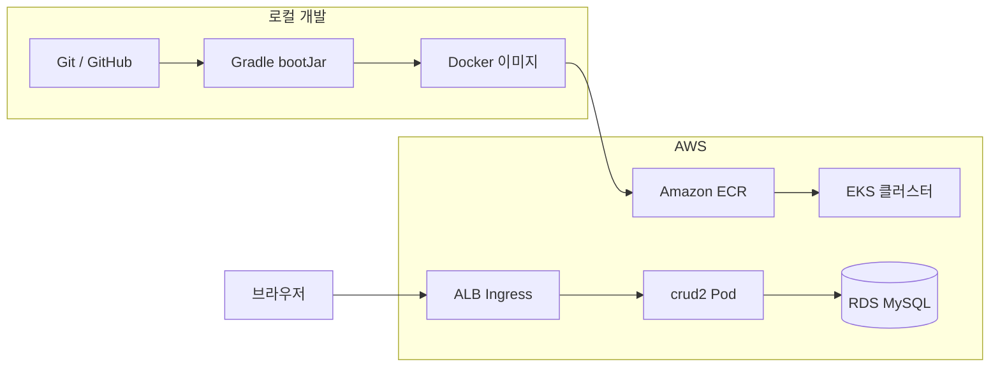
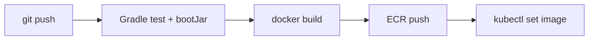

# crud2 — Git 설정부터 EKS 배포까지

`crud2`(Spring Boot 3 · Java 17 · Thymeleaf · JPA) 프로젝트를 **Git으로 버전 관리**하고, **Docker 이미지**를 만든 뒤 **Amazon EKS**에 배포해 **Amazon RDS MySQL**에 연결하는 전체 흐름을 정리한 문서입니다.

> 기존 문서 [`deployment-full-journey.md`](./deployment-full-journey.md)는 **EC2 + Docker + RDS** 경로입니다.  
> 이 문서는 **EKS(쿠버네티스)** 를 대상으로 합니다.

---

## 0. 전체 아키텍처



| 계층 | 역할 |
|------|------|
| Git | 소스 코드 버전 관리 |
| Gradle + Dockerfile | JAR 빌드 → 컨테이너 이미지 생성 |
| ECR | Docker 이미지 저장소 |
| EKS | 컨테이너 오케스트레이션 (Pod 스케줄링, 무중단 배포) |
| RDS | 운영용 MySQL 데이터베이스 |
| ALB | 외부 HTTP/HTTPS 트래픽 진입점 |

---

## 1. 프로젝트 개요

| 항목 | 내용 |
|------|------|
| 프로젝트 경로 | `d:\crud2` |
| 스택 | Spring Boot 3.3.12, Java 17, Thymeleaf, JPA, Lombok |
| 로컬 DB | H2 (`application.properties`) |
| Docker Compose DB | MySQL 컨테이너 (`application-docker.properties`) |
| 운영 DB | MySQL on RDS (`application-prod.properties`, 프로파일 `prod`) |
| 컨테이너 | 멀티 스테이지 `Dockerfile` |

### 패키지 구조

```
com.example.crud2
├── Crud2Application.java
├── controller/DoController.java
├── service/DoService.java
├── repository/DoRepository.java
├── entity/DoIt.java
└── dto/DoDto.java
```

### 주요 URL

| HTTP | 경로 | 설명 |
|------|------|------|
| GET | `/list` | 목록 |
| GET | `/list/{num}` | 상세 |
| GET | `/mains/add` | 등록 폼 |
| POST | `/mains/create` | 등록 처리 |
| GET | `/list/{num}/edit` | 수정 폼 |
| POST | `/mains/update` | 수정 처리 |
| GET | `/list/{num}/delete` | 삭제 |

> 루트 `/` 는 매핑이 없습니다. 반드시 **`/list`** 로 접속하세요.

### 프로파일별 DB 설정

| 프로파일 | 설정 파일 | DB |
|----------|-----------|-----|
| (기본) | `application.properties` | H2 `~/test_crud2` |
| `docker` | `application-docker.properties` | docker-compose MySQL |
| `prod` | `application-prod.properties` | RDS MySQL |

---

## 2. Git 설정

### 2-1. 저장소 초기화

프로젝트 루트에서:

```powershell
cd d:\crud2
git init
git add .
git commit -m "Initial commit: crud2 Spring Boot CRUD app"
```

### 2-2. `.gitignore` 확인

다음 항목이 Git에서 제외됩니다.

| 패턴 | 이유 |
|------|------|
| `build/`, `.gradle/` | 빌드 산출물 |
| `*.pem` | SSH 키 (절대 커밋 금지) |
| `*.tar` | Docker 이미지 tar (GitHub 100MB 제한) |
| `.idea/` | IDE 설정 |

### 2-3. GitHub 원격 저장소 연결

```powershell
git remote add origin https://github.com/<사용자명>/crud2.git
git branch -M main
git push -u origin main
```

### 2-4. 보안 주의사항

- RDS 비밀번호, `.pem` 키 파일을 Git에 커밋하지 마세요.
- `application-prod.properties`에 RDS 엔드포인트가 있을 수 있습니다.  
  운영 비밀번호는 **환경 변수** 또는 **Kubernetes Secret**으로만 주입하세요.

---

## 3. 로컬 개발 및 테스트

### 3-1. Gradle로 직접 실행 (H2)

```powershell
.\gradlew.bat bootRun
```

브라우저: `http://localhost:8080/list`

### 3-2. 테스트 실행

```powershell
.\gradlew.bat test
```

### 3-3. Docker Compose로 실행 (MySQL + 앱)

```powershell
docker compose up --build
```

- MySQL 컨테이너: `crud2-mysql` (포트 3306)
- 앱 컨테이너: `crud2-app` (포트 8080, 프로파일 `docker`)

---

## 4. Docker 이미지 빌드

### 4-1. Dockerfile 구조

`Dockerfile`은 멀티 스테이지 빌드를 사용합니다.

1. **builder 스테이지**: Gradle로 fat JAR 생성
2. **runtime 스테이지**: JRE만 포함, 포트 8080 노출

```dockerfile
FROM eclipse-temurin:17-jdk-alpine AS builder
# ... Gradle bootJar ...

FROM eclipse-temurin:17-jre-alpine
COPY --from=builder /app/app.jar app.jar
EXPOSE 8080
ENTRYPOINT ["sh", "-c", "java $JAVA_OPTS -jar app.jar"]
```

### 4-2. 이미지 빌드

```powershell
docker build -t crud2:latest .
```

### 4-3. 로컬 단독 실행 (prod 프로파일 + RDS)

```powershell
docker run -d -p 8080:8080 --name crud2-app `
  -e SPRING_PROFILES_ACTIVE=prod `
  -e SPRING_DATASOURCE_URL="jdbc:mysql://<RDS엔드포인트>:3306/crud2_db?characterEncoding=UTF-8&serverTimezone=Asia/Seoul&allowPublicKeyRetrieval=true" `
  -e SPRING_DATASOURCE_USERNAME="crud2" `
  -e SPRING_DATASOURCE_PASSWORD="<비밀번호>" `
  crud2:latest
```

---

## 5. AWS 인프라 준비

EKS 배포 전에 아래 AWS 리소스가 필요합니다.

### 5-1. VPC

- EKS 클러스터용 **퍼블릭·프라이빗 서브넷** (최소 2개 AZ)
- `eksctl create cluster` 사용 시 자동 생성 가능

### 5-2. Amazon RDS MySQL

| 항목 | 권장 |
|------|------|
| 엔진 | MySQL 8.x |
| 인스턴스 클래스 | db.t3.micro (학습용) |
| DB 이름 | `crud2_db` |
| 퍼블릭 액세스 | **비활성화** (EKS와 같은 VPC) |
| 보안 그룹 | EKS 노드/파드 SG에서 **3306**만 허용 |

JDBC URL 예시:

```
jdbc:mysql://<RDS엔드포인트>:3306/crud2_db?characterEncoding=UTF-8&serverTimezone=Asia/Seoul&allowPublicKeyRetrieval=true
```

### 5-3. Amazon ECR 리포지토리

```powershell
aws ecr create-repository --repository-name crud2 --region ap-northeast-2
```

이미지 빌드 및 push:

```powershell
# ECR 로그인
aws ecr get-login-password --region ap-northeast-2 | docker login --username AWS --password-stdin <계정ID>.dkr.ecr.ap-northeast-2.amazonaws.com

# 빌드 및 태그
docker build -t crud2:latest .
docker tag crud2:latest <계정ID>.dkr.ecr.ap-northeast-2.amazonaws.com/crud2:latest

# push
docker push <계정ID>.dkr.ecr.ap-northeast-2.amazonaws.com/crud2:latest
```

---

## 6. EKS 클러스터 생성

### 6-1. 사전 도구 설치

| 도구 | 용도 |
|------|------|
| AWS CLI | AWS 리소스 관리 (`aws configure`) |
| kubectl | Kubernetes 클러스터 제어 |
| eksctl | EKS 클러스터 생성·관리 (권장) |
| Helm | 차트 기반 패키지 설치 (ALB Controller 등) |

### 6-2. 클러스터 생성 (`eksctl`)

`cluster.yaml` 예시:

```yaml
apiVersion: eksctl.io/v1alpha5
kind: ClusterConfig

metadata:
  name: crud2-cluster
  region: ap-northeast-2

nodeGroups:
  - name: ng-1
    instanceType: t3.medium
    desiredCapacity: 2
    minSize: 1
    maxSize: 3
```

```powershell
eksctl create cluster -f cluster.yaml
```

### 6-3. kubeconfig 설정

```powershell
aws eks update-kubeconfig --region ap-northeast-2 --name crud2-cluster
kubectl get nodes
```

### 6-4. AWS Load Balancer Controller 설치

EKS에서 ALB Ingress를 사용하려면 컨트롤러 설치가 필요합니다.

```powershell
# OIDC 프로바이더 연결
eksctl utils associate-iam-oidc-provider --cluster crud2-cluster --approve

# IAM 정책 생성 및 ServiceAccount 연결 (AWS 공식 문서 참고)
# https://docs.aws.amazon.com/ko_kr/eks/latest/userguide/aws-load-balancer-controller.html

# Helm으로 설치
helm repo add eks https://aws.github.io/eks-charts
helm install aws-load-balancer-controller eks/aws-load-balancer-controller `
  -n kube-system `
  --set clusterName=crud2-cluster `
  --set serviceAccount.create=false `
  --set serviceAccount.name=aws-load-balancer-controller
```

---

## 7. Kubernetes 매니페스트

프로젝트에 `k8s/` 폴더를 만들고 아래 파일을 추가합니다.

### 7-1. Secret (DB 비밀번호)

`k8s/secret.yaml`:

```yaml
apiVersion: v1
kind: Secret
metadata:
  name: crud2-db-secret
type: Opaque
stringData:
  username: crud2
  password: "<RDS비밀번호>"
```

> 운영 환경에서는 **AWS Secrets Manager + External Secrets Operator** 사용을 권장합니다.

### 7-2. ConfigMap (비밀 아닌 설정)

`k8s/configmap.yaml`:

```yaml
apiVersion: v1
kind: ConfigMap
metadata:
  name: crud2-config
data:
  SPRING_PROFILES_ACTIVE: "prod"
  SPRING_DATASOURCE_URL: "jdbc:mysql://<RDS엔드포인트>:3306/crud2_db?characterEncoding=UTF-8&serverTimezone=Asia/Seoul&allowPublicKeyRetrieval=true"
```

### 7-3. Deployment

`k8s/deployment.yaml`:

```yaml
apiVersion: apps/v1
kind: Deployment
metadata:
  name: crud2
  labels:
    app: crud2
spec:
  replicas: 2
  selector:
    matchLabels:
      app: crud2
  template:
    metadata:
      labels:
        app: crud2
    spec:
      containers:
        - name: crud2
          image: <계정ID>.dkr.ecr.ap-northeast-2.amazonaws.com/crud2:latest
          ports:
            - containerPort: 8080
          envFrom:
            - configMapRef:
                name: crud2-config
          env:
            - name: SPRING_DATASOURCE_USERNAME
              valueFrom:
                secretKeyRef:
                  name: crud2-db-secret
                  key: username
            - name: SPRING_DATASOURCE_PASSWORD
              valueFrom:
                secretKeyRef:
                  name: crud2-db-secret
                  key: password
          readinessProbe:
            httpGet:
              path: /list
              port: 8080
            initialDelaySeconds: 30
            periodSeconds: 10
          livenessProbe:
            httpGet:
              path: /list
              port: 8080
            initialDelaySeconds: 60
            periodSeconds: 30
          resources:
            requests:
              memory: "512Mi"
              cpu: "250m"
            limits:
              memory: "1Gi"
              cpu: "500m"
```

### 7-4. Service

`k8s/service.yaml`:

```yaml
apiVersion: v1
kind: Service
metadata:
  name: crud2
spec:
  selector:
    app: crud2
  ports:
    - port: 80
      targetPort: 8080
  type: ClusterIP
```

### 7-5. Ingress (ALB)

`k8s/ingress.yaml`:

```yaml
apiVersion: networking.k8s.io/v1
kind: Ingress
metadata:
  name: crud2-ingress
  annotations:
    kubernetes.io/ingress.class: alb
    alb.ingress.kubernetes.io/scheme: internet-facing
    alb.ingress.kubernetes.io/target-type: ip
    alb.ingress.kubernetes.io/listen-ports: '[{"HTTP": 80}]'
spec:
  rules:
    - http:
        paths:
          - path: /
            pathType: Prefix
            backend:
              service:
                name: crud2
                port:
                  number: 80
```

HTTPS 적용 시 ACM 인증서 ARN 어노테이션 추가:

```yaml
alb.ingress.kubernetes.io/certificate-arn: arn:aws:acm:ap-northeast-2:<계정ID>:certificate/<인증서ID>
alb.ingress.kubernetes.io/listen-ports: '[{"HTTP": 80}, {"HTTPS": 443}]'
alb.ingress.kubernetes.io/ssl-redirect: '443'
```

### 7-6. 배포 실행

```powershell
kubectl apply -f k8s/secret.yaml
kubectl apply -f k8s/configmap.yaml
kubectl apply -f k8s/deployment.yaml
kubectl apply -f k8s/service.yaml
kubectl apply -f k8s/ingress.yaml
```

### 7-7. 배포 확인

```powershell
kubectl get pods
kubectl logs -l app=crud2
kubectl get ingress
```

Ingress의 **ADDRESS** (ALB DNS)로 접속:

```
http://<ALB-DNS>/list
```

---

## 8. 네트워크·보안 체크리스트

| 항목 | 설정 |
|------|------|
| RDS 보안 그룹 | EKS **노드 SG** 또는 **파드 SG**에서 3306 허용 |
| RDS 위치 | EKS와 **같은 VPC** |
| ECR 접근 권한 | 노드 IAM Role에 `AmazonEC2ContainerRegistryReadOnly` |
| 비밀번호 관리 | Git·매니페스트 평문 저장 금지 → Secret / Secrets Manager |
| HTTPS | ACM 인증서 + Ingress `certificate-arn` 어노테이션 |

### RDS 연결 실패 시 점검

| 증상 | 원인 | 해결 |
|------|------|------|
| `Communications link failure` | RDS SG가 EKS 트래픽 차단 | RDS SG에 EKS 노드 SG 추가 |
| `Connect timed out` | RDS가 다른 VPC에 있음 | 같은 VPC로 이동 또는 VPC Peering |
| `Access denied` | 계정·비밀번호 오류 | Secret 값 확인 |
| Pod `CrashLoopBackOff` | JDBC URL 오류 | ConfigMap URL 확인 |

---

## 9. CI/CD 자동화 (권장)

GitHub Actions로 push 시 자동 빌드·배포 흐름:



`.github/workflows/deploy.yml` 핵심 단계:

1. `push` to `main` 트리거
2. `./gradlew test bootJar`
3. ECR 로그인 → `docker build` → `docker push`
4. `kubectl set image deployment/crud2 crud2=<새이미지태그>`

필요한 GitHub Secrets:

| Secret | 값 |
|--------|-----|
| `AWS_ACCESS_KEY_ID` | IAM 액세스 키 |
| `AWS_SECRET_ACCESS_KEY` | IAM 시크릿 키 |
| `AWS_REGION` | `ap-northeast-2` |
| `EKS_CLUSTER_NAME` | `crud2-cluster` |

---

## 10. EC2 vs EKS 비교

| 항목 | EC2 + Docker | EKS |
|------|-------------|-----|
| 난이도 | 낮음 | 높음 |
| 비용 | EC2 1대 | 클러스터 + 노드 + ALB |
| 확장 | 수동 | `replicas` 조정, HPA |
| 무중단 배포 | 어려움 | Rolling update 기본 지원 |
| 적합 | 학습·소규모 | 트래픽 증가·운영 자동화 |

---

## 11. 한 줄 요약 (순서)

1. `git init` → GitHub push
2. 로컬: `gradlew bootRun` 또는 `docker compose up`
3. `docker build` → **ECR push**
4. **RDS MySQL** 생성 (EKS와 같은 VPC)
5. **eksctl**로 EKS 클러스터 생성
6. `k8s/` 매니페스트 작성 → `kubectl apply`
7. ALB Ingress DNS로 `/list` 확인
8. (선택) GitHub Actions로 자동 배포

---

## 12. 관련 문서

| 문서 | 내용 |
|------|------|
| [deployment-full-journey.md](./deployment-full-journey.md) | EC2 + Docker Hub + RDS 실전 기록 |
| [aws-docker-mysql-deploy.md](./aws-docker-mysql-deploy.md) | AWS + MySQL 배포 개요 |
| [ec2-docker-rds.md](./ec2-docker-rds.md) | EC2 + Docker + RDS 순서 |
| [docker-deployment.md](./docker-deployment.md) | 로컬 Docker / Compose |
| [crud2-docker-image.md](./crud2-docker-image.md) | Docker 이미지 상세 |
| [spring-boot-docker-aws-guide.md](./spring-boot-docker-aws-guide.md) | Spring Boot + Docker + AWS 가이드 |

---

이 문서는 `crud2` 프로젝트 기준으로 작성되었습니다.  
실제 엔드포인트·계정·IP·계정 ID는 배포 시 본인 AWS 콘솔 값으로 바꿔 사용하세요.
